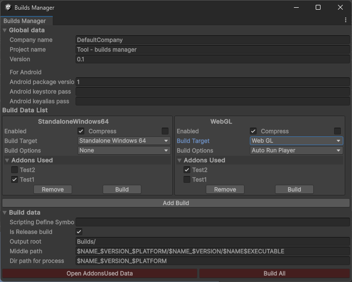

# Build Manager

[Russian](./README.md) | Eng

## Description

The tool is designed to accelerate the creation of game builds for various platforms, as well as to simplify the use of different `Scripting Define Symbols` in different builds.

## Guide

To open the build manager, go to `File` -> `Builds Manager`.


In the build manager, you can modify various data:

* **Global data** - global data:
  * **Company name** - company name;
  * **Product name** - project name;
  * **Version** - project version;
  * **Android bundle version** - Android package version;
  * **Android keystore pass** - Android keystore pass;
  * **Android keyalias pass** - Android keyalias pass.
* **Build Data List** - List of project build instance settings:
  * **Build list**:
    * **Enabled** - enable/disable instance;
    * **Compress** - create a .zip archive;
    * **Build Target** - build platform;
    * **Build Options** - additional options;
    * **Addons Used** - used addons (list displayed if addons are already created);
    * **Remove** - remove current build instance;
    * **Build** - build current instance.
  * **Add Build** - add a new build instance to the list;
* **Build data** - build data:
  * **Scripting define symbols** - add additional "Scripting define symbols" for a specific build, will be added to definitions for each build;
  * **Is Release build** - apply release optimization for the build. If unchecked, optimized for faster building.
  * **Output root** - output root path
  * **Middle path** - specify a specific path. Supports variables
  * **Dir path** - directory path that will be archived.
* **Open AddonsUsed Data** - button that shows the ScriptableObject for configuring used addons;
* **Build All** - create all enabled project build instances.



List of supported variables for path:

* **$NAME –** product name, with all separators replaced by '_'
* **$PLATFORM** - platform
* **$VERSION** - PlayerSettings.bundleVersion
* **$DATESHORT** - [last 2 digits of the year] [month] [day]
* **$YEARSHORT** - last 2 digits of the year
* **$DATE** - [year] [month] [day]
* **$YEAR** - year
* **$MONTH** - month
* **$DAY** - day
* **$TIME** - [hour] [minute]
* **$ADDONS** - list of names of used addons in the build
* **$EXECUTABLE** - executable file for a specific platform. For example. .exe for Windows, .apk for Android...

Clicking on the `Open AddonsUsed Data` button will open a ScriptableObject needed to configure used addons.

Clicking on `+` creates an addon that contains the name displayed in the settings manager for the build instance and the used `Scripting define symbols` for the current addon.


## Install

Download and use the .unitypackage from the [Releases](https://github.com/ShutovKS/Builds-Manager/releases) section.

## Information

### Author and Developer

* Shutov Kirill (ShutovKS), Russia

### License

``` text
MIT License
```
